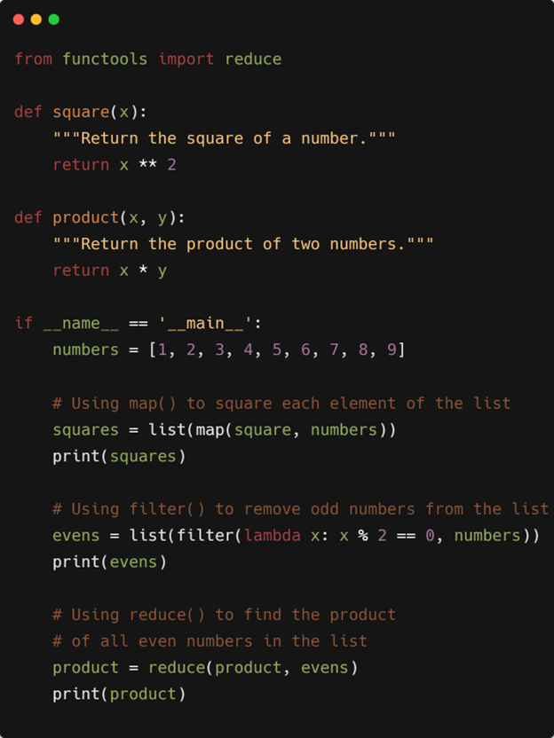

Higher order functions Python:

Write a Python script to implement the _map()_, _filter()_, and _reduce()_ functions on a list of integers.

1. The map() function should square each element of the list,
2. The filter() function should remove all odd numbers from the list.
3. The reduce() function should find the product of all the even numbers in the list.

The script should follow Python syntax and conventions.

In this solution, we define two helper functions: square() and product(). The square() function takes a number and returns its square, and the product() function takes two numbers and returns their product.

We then define a list of integers called numbers. We use the map() function to square each element of the list by passing the square() function as an argument to map(). We convert the resulting map object to a list using the list() function, and print it to the console.

We use the filter() function to remove all odd numbers from the list by passing a lambda function as an argument to filter() that checks whether each number is even. We convert the resulting filter object to a list using the list() function, and print it to the console.

Finally, we use the reduce() function to find the product of all even numbers in the list by passing the product() function and the evens list as arguments to reduce(). We print the resulting product to the console.

The solution follows Python syntax and conventions by using docstrings to document the functions, using meaningful function and variable names, and following the PEP 8 style guide for formatting the code.

