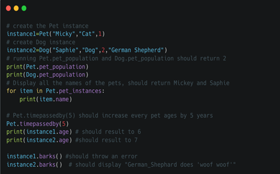

**Python Basics: OOP**

1. OOP

  1. Everything in python is class and object. Let's verify that. Run the following code: 
  
  
  
  2. Compare the result of step a and step b: 
  
  
 
  3. Create two classes **Pet** and **Dog**
    1. Requirements for **Pet** class
      1. Three class attributes **pet\_population** , **pet\_instance** and **current\_year**
      2. Init constructor **\_\_init\_\_(self,name,category,age)**, name is name of pet,category could be dog,cat,bird etc. and age is age of pet
      3. An instance method **hellofrompet** that prints hello from petname
      4. Create a class method **timepassedby** which takes years as argumentshould automatically increase the age of all the pet object as soon as the method is applied

**pet\_population** should show the number of pets created and  **pet\_instance** is the list of pet object
    1. Requirements for **Dog** class
      1. Dog class should **inherit Pet** class attributes and methods. Apart from that the init constructor takes addition "breed" argument
      2. Define the instance method **barks** which displays the breed does woof woof.

Validate your code: Run the following piece of code 

